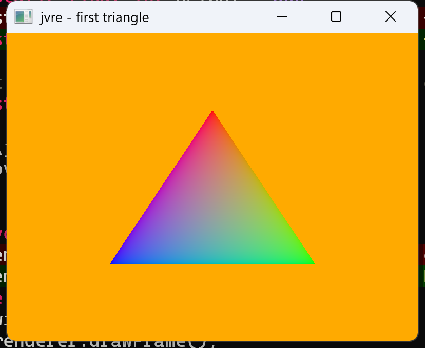

# jvre — Java Vulkan Rendering Engine

[](https://github.com/Milquetoad/jvre/actions/workflows/ci.yml)



A general-purpose rendering framework written **from scratch in Java on top of [Vulkan](https://www.vulkan.org/)** (via [LWJGL](https://www.lwjgl.org/)). The goal is twofold:

1. **Learn graphics from first principles** — understand every layer, from the Vulkan instance up to a full render loop, with no engine hiding the details.
2. **Ship a real, reusable framework** — a coherent, documented, cross-platform library, delivered with the polish of a professional product (the finish line is a stable 1.0 on Maven Central).

> **Status: 1.1 — on Maven Central.** Both API altitudes below are built, and the [public API](docs/api-surface.md) is a semver compatibility promise. 1.1 adds backward-compatible capability over 1.0 (render-to-texture, headless rendering, HDR targets, MSDF text, runtime fonts, shader hot-reload, effect input channels, sampler config). Continued capability growth (the full fully-fledged feature set) is planned — see the [roadmap](vault/Project/Roadmap.md).

## Two altitudes, one engine

jvre is layered so you can work at the level a task needs — and mix levels in one frame:

- **High-level "just draw" (`Renderer2D`)** — shapes, text, and images via plain method calls; build 2D scenes, UI, and visualizations **without writing shaders**.
- **Shader effects (`ShaderEffect`)** — Shadertoy-style: one GLSL fragment shader over a fullscreen quad, compiled at runtime.
- **Low-level escape hatch (L1)** — your own geometry, vertex layouts, shaders, uniforms, and textures (plus a `Camera` for 3D), when you want full control without leaving the engine.

Reachable but not promised, post-1.0: compute and hardware-accelerated ray/path tracing.

## Scope — what jvre is and isn't

jvre is a **rendering framework**: it gets pixels on screen and gives you the layers to do it at any altitude. It is deliberately **not a game engine** (no entity/scene system, physics, or audio) and **not a GUI toolkit** (the bundled immediate-mode GUI is a *demo* of what L2 enables, not a shipped widget library). Those are *capabilities you can build on jvre*, not features it ships — keeping that boundary is what keeps the core sharp.

## Documentation

User guides live in **[`docs/`](docs/)**:

- **[Getting started](docs/getting-started.md)** — add the dependency, then a complete runnable "hello, rectangle".
- **[2D graphics](docs/2d-graphics.md)** — the `Renderer2D` surface in full.
- **[Shader effects](docs/shader-effects.md)** · **[Custom pipelines](docs/custom-pipelines.md)** — the lower altitudes.

The [`vault/`](vault/) directory is a separate, *internal* Obsidian knowledge base (design notes + a dated progress log) — useful if you want the reasoning behind the design.

## Requirements

| Tool | Version | Notes |
|---|---|---|
| JDK | 21 | Gradle toolchain will enforce this |
| GPU + driver | Vulkan 1.3 | Dynamic rendering (the render path) is core in 1.3; any vendor, a discrete GPU is preferred automatically |
| Vulkan SDK | 1.3+ | **Optional** — only for the validation layers during development. Not needed to *build*: shaders compile via the bundled shaderc, no SDK required. |

LWJGL (Vulkan + GLFW bindings) is pulled in by Gradle — no manual install. The Vulkan **loader** itself (`vulkan-1.dll` / `libvulkan.so`) comes from your system / GPU driver, not from LWJGL.

## Build & run

The project ships a Gradle **wrapper**, so you don't need Gradle installed — just a JDK 21.

```bash
# Windows
./gradlew.bat run

# Linux / macOS
./gradlew run
```

You should see a window open and console output reporting each Vulkan bootstrap step (instance, surface, chosen GPU, ...). Close the window to exit.

## Using jvre as a library

Published on **Maven Central**. For a complete runnable example and a walkthrough, see **[docs/getting-started.md](docs/getting-started.md)**.

```gradle
repositories {
    mavenCentral()
}

dependencies {
    implementation 'io.github.milquetoad:jvre:1.1.0'

    // jvre does NOT bundle platform natives -- you choose them for your OS.
    // Add the natives classifier for the LWJGL modules jvre uses:
    def lwjgl = '3.3.4'
    def natives = 'natives-windows' // or natives-linux / natives-macos / -arm64
    runtimeOnly("org.lwjgl:lwjgl:$lwjgl:$natives")
    runtimeOnly("org.lwjgl:lwjgl-glfw:$lwjgl:$natives")
    runtimeOnly("org.lwjgl:lwjgl-vma:$lwjgl:$natives")
    runtimeOnly("org.lwjgl:lwjgl-shaderc:$lwjgl:$natives")
    runtimeOnly("org.lwjgl:lwjgl-spvc:$lwjgl:$natives")
    runtimeOnly("org.lwjgl:lwjgl-stb:$lwjgl:$natives")
    runtimeOnly("org.lwjgl:lwjgl-msdfgen:$lwjgl:$natives")
}
```

The LWJGL libraries themselves arrive transitively through jvre's POM; only the per-OS **natives** are yours to pick (the standard LWJGL consumer pattern). A future convenience may bundle these.

## Cross-platform

The code is OS-agnostic by design: windowing and surface creation go through GLFW, which picks the right platform call on each OS. The LWJGL **natives** classifier is auto-detected from the build host (`build.gradle`), so no edit is needed to build on Windows, Linux, or macOS. Windows and Linux are first-class (both run in CI); macOS additionally needs MoltenVK and the `-XstartOnFirstThread` JVM flag.

## Project layout

```
src/main/java/jvre/core/   The library: Window, Instance, Surface, Device, Swapchain,
                           Renderer, Renderer2D, Pipeline, Buffer, Texture, Font, Camera, ...
src/main/java/jvre/        Main.java -- the demo showcase (wiring + a tour of every altitude)
src/main/java/jvre/demo/   Worked examples built ON the library (e.g. the immediate-mode GUI),
                           excluded from the published jar -- not part of the API
src/main/java/jvre/tools/  Build-time tooling (the shader compiler task), also not shipped
src/main/glsl/             Built-in GLSL shaders, compiled to SPIR-V at build time via the
                           bundled shaderc (no Vulkan SDK needed)
docs/                      User-facing guides (getting started + the API guides)
build.gradle               Build config (LWJGL deps, JDK 21 toolchain, shader compilation, publishing)
vault/                     Internal Obsidian knowledge base — design notes + progress log
```

The [`vault/`](vault/) directory is a companion **Obsidian knowledge base** maintained alongside the code: every concept gets a note, and `vault/Project/Progress Log.md` is a dated diary of progress. Start at `vault/Home.md`. (For *using* jvre, see [`docs/`](docs/) instead.)

## Status &amp; roadmap

The full Vulkan substrate and both API altitudes are built and run cleanly
(validation-silent). What works today:

- **Modern Vulkan core** — dynamic rendering + synchronization2 (Vulkan 1.3),
  scored GPU selection with an override, VMA-managed memory, a resizable swapchain
  with 2 frames in flight, and **MSAA**.
- **L2 `Renderer2D`** — fills, strokes, text (SDF *and* MSDF glyphs, with runtime
  font loading), and images (configurable sampling), with an analytic SDF render
  path (crisp curves at any size) and a transform stack.
- **`ShaderEffect`** — runtime-compiled fullscreen fragment-shader effects, with a
  contract guard, structured compile diagnostics, live hot-reload, and Shadertoy-style
  input channels (`iChannel0..3`).
- **L1 escape hatch** — user-defined pipelines (your geometry + shaders + uniforms
  + textures), index buffers, a `Camera` helper for 3D, and **render-to-texture**
  (offscreen targets, incl. HDR float formats — render into one, then sample it back).
- **Headless rendering** — drive the renderer with no window and read pixels back
  out (offscreen render + `readPixels`).
- **Interactivity & capability knobs** — a per-frame input snapshot, `time()`/`dt()`,
  and creation-time vsync / MSAA / GPU options.
- **Delivery** — cross-platform CI (Windows + Linux), GPG-signed and published to
  Maven Central; natives are consumer-selected (not bundled).

The **post-1.0 feature roadmap** (jvre is built out toward a fully-fledged
framework) lives in **[`vault/Project/Roadmap.md`](vault/Project/Roadmap.md)**; the
dated build diary is [`vault/Project/Progress Log.md`](vault/Project/Progress%20Log.md).
Planned: instancing, compute, ray/path tracing, and the remaining catalogued L2
refinements.

## Contributing

See [CONTRIBUTING.md](CONTRIBUTING.md). Note the contributor license agreement requirement, which keeps dual-licensing options open.

## License

Licensed under the **GNU Affero General Public License v3.0** (AGPL-3.0). See [LICENSE](LICENSE).

In short: you may use, study, modify, and share this software freely, but derivative works — **including software you make available to others over a network** — must also be released under the AGPL. For use under different terms, contact the author about a commercial license.

Copyright © 2026 Peder Godal.
